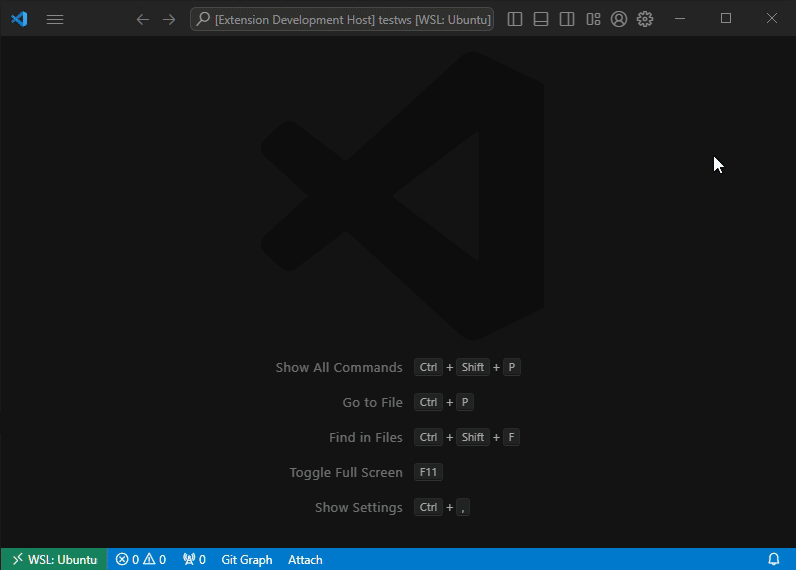

# eBUS Notebook

A VS Code extension providing a notebook for eBUS activities using ebus-typespec and an optional ebusd connection, as well as some commands and code actions.

## Features

This extensions provides a VS Code notebook that eases the process of creating/manipulating eBUS message definitions in TypeSpec using the ebus-typespec library.

Such a notebook consists of several cells including typespec type cells that are used for defining the message(s).
Please refer to [`notebook.ebnb`](example/notebook.ebnb) for an example or run the `Create New eBUS Notebook" command.

## Requirements

In order to use this extension, install
[TypeSpec for VS Code](https://marketplace.visualstudio.com/items?itemName=typespec.typespec-vscode)
in VS Code extensions as well as the
[eBUS TypeSpec package](https://github.com/john30/ebus-typespec) (at least version 0.3.1)
in the workspace:  
`npm i @ebusd/ebus-typespec`.

The best way to use this extension is by having an instance of ebusd running in the network that can test and decode the message definition(s), although this is optional.

That ebusd instance needs to have the "--enabledefine" switch set in order to use it for that.

It is accessed by this extension via the ebusd REPL port that can be adjusted via the settings.

## Extension Settings

* `ebus-notebook.conversion.show`: Whether to show the conversion process terminal or use a task instead of a terminal (default hidden).
* `ebus-notebook.conversion.cmd`: The command to use for converting TypeSpec to ebusd CSV, e.g. `tsp2ebusd -o ${outFile} ${inFile}` (default is to call this via npm exec).
* `ebus-notebook.ebusd.host`: The host name or IP address of ebusd REPL to connect to, e.g. `localhost` (default unset).
* `ebus-notebook.ebusd.port`: The port number of ebusd REPL to connecto to, e.g. `8888` (default).

## Release Notes

Please refer to the [CHANGELOG](CHANGELOG.md) for release infos.
